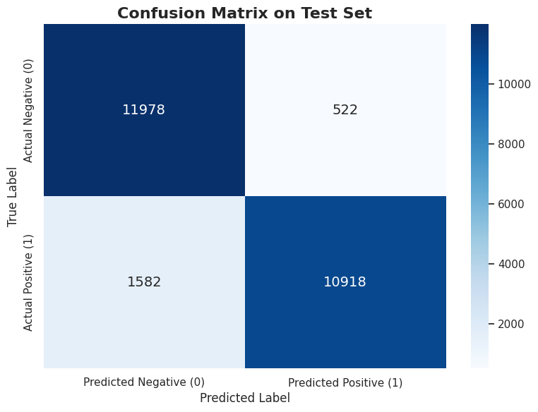

# 基于预训练模型的情感分析系统设计与实现

## 1. 引言 (Introduction)

### 1.1 项目背景与研究意义
在当前的自然语言处理（Natural Language Processing, NLP）领域，随着深度学习技术的飞速发展，机器对人类语言的理解能力取得了突破性进展。情感分析（Sentiment Analysis）作为 NLP 领域最基础且应用最广泛的任务之一，旨在让计算机自动识别并提取主观文本中的情绪色彩与态度倾向。在实际商业场景中，该技术被广泛应用于舆情监控、商品评论分析以及智能客服等领域。

早期的情感分析多依赖于复杂的特征工程（如 TF-IDF）与传统机器学习算法（如 SVM、朴素贝叶斯），这些方法不仅耗费大量人力，且难以捕捉文本深层的上下文语境。自 2018 年 Google 提出 BERT 模型以来，基于 Transformer 架构的**预训练语言模型（Pre-trained Language Models, PLMs）**彻底改变了 NLP 的研究范式，使得模型能够在大规模无监督语料上学习到丰富的通用语言表示。本项目正是基于这一技术背景展开的设计与实践。

### 1.2 核心需求与项目目标
本项目的核心需求是构建一个高效的二分类自然语言理解系统，能够准确判断给定文本输入（如电影评论）的情感倾向（正面 Positive / 负面 Negative）。

围绕上述需求，本项目设定了以下三个核心实施目标：
1. **验证深度学习架构的有效性**：通过实证研究，观察并验证基于 Transformer 架构的深度学习模型在自然语言理解任务上的卓越性能。
2. **掌握“迁移学习”核心范式**：跳出传统的“从零训练（Train from scratch）”模式，深度实践当前工业界最主流的 **“通用大数据预训练模型 + 特定小数据集微调（Pre-training + Fine-tuning）”** 的迁移学习范式。
3. **构建端到端的人工智能应用**：完成从数据获取、探索性分析（EDA）、模型微调、科学评估到最终 Web 可视化交互界面的全流程闭环开发。

### 1.3 技术选型与软硬件环境规划
为确保项目的顺利推进，并重点关注算法逻辑与模型表现本身，本项目在起步阶段制定了明确的技术与环境规划：

* **核心算法生态**：全面采用 Python 语言，基于深度学习框架 `PyTorch` 以及业界领先的开源生态 `Hugging Face (Transformers & Datasets)` 进行开发。
* **计算资源与环境**：鉴于深度学习（尤其是 Transformer 模型）对硬件算力（GPU 显存）的较高要求，本项目采取**“云端优先”**策略。摒弃复杂的本地 CUDA 环境配置，直接采用云端 Jupyter Notebook 托管平台（如 Google Colab 或 Kaggle Notebook）。
* **硬件加速**：充分利用云平台提供的免费 GPU 计算资源（如 NVIDIA Tesla T4 16GB），以满足预训练模型进行张量运算的算力需求，大幅加速模型的微调训练过程。

## 2. 数据与探索性分析 (Data & Preprocessing)

深度学习模型的性能高度依赖于输入数据的质量。本阶段主要完成标准数据集的加载、数据分布的统计分析以及针对 Transformer 模型的文本数字化处理。

### 2.1 数据集获取与切分
为保证模型评估的客观性与结果的可复现性，本项目选用 NLP 领域公认的情感分析基准数据集——**IMDB 电影评论数据集 (IMDB Movie Reviews Dataset)**。

借助 Hugging Face 的 `datasets` 库，系统成功从云端加载了该数据集。为严格防止数据泄露（Data Leakage），数据集已被明确划分为两个互不相交的子集：
* **训练集 (Train Set)**：共计 25,000 条样本，用于模型的微调训练。
* **测试集 (Test Set)**：共计 25,000 条样本，在训练阶段对模型完全不可见，仅用于最终的泛化能力评估。

### 2.2 探索性数据分析 (EDA)
在将文本输入模型之前，本项目对训练集进行了详尽的探索性数据分析，以指导后续的预处理策略与评估指标选择。分析结果如下图所示：

> *图 1：IMDB 训练集正负样本分布（左）与文本长度分布直方图（右）*

基于上述图表，得出以下核心结论：
1. **类别完全平衡 (Perfect Class Balance)**：如左图所示，训练集包含准确的 12,500 条正面评论与 12,500 条负面评论。这意味着我们无需在训练时引入类别权重（Class Weights）或过采样/欠采样策略，且在后续模型评估时，**准确率（Accuracy）**将是一个极其可靠的核心评价指标。
2. **文本长度分布与截断策略制定**：如右图所示，评论单词数的分布呈现明显的右偏态。整体平均词数为 234 词，而 **95% 的评论单词数均在 598 词以下**。
    * **工程决策**：考虑到原生 Transformer 架构具有 $O(N^2)$ 的自注意力计算复杂度，处理超长文本将呈指数级消耗 GPU 显存。结合上述统计规律，本项目决定采用预训练模型的标准最大长度 **512 (Max Length = 512)** 进行输入截断。这一策略在显著降低计算资源开销的同时，能够保留绝大多数样本（超过90%）的完整语义信息，是精度与性能之间的最佳折中。

### 2.3 文本分词与数字化 (Tokenization)
计算机无法直接理解自然语言文本，必须将其转化为固定维度的数字张量（Tensor）。本项目采用与基座模型相匹配的 `distilbert-base-uncased` 分词器进行处理。

预处理管线（Preprocessing Pipeline）对所有 50,000 条数据进行了统一处理，核心步骤包括：
* **子词分词 (Sub-word Tokenization)**：将英文单词切分为更细粒度的 Token。
* **张量对齐 (Padding & Truncation)**：对短于 512 的句子使用 `0` 进行填充（Padding）；对长于 512 的句子进行直接截断（Truncation）。
* **特征映射**：将文本映射为模型所需的 `input_ids`（词向量索引）与 `attention_mask`（注意力掩码，用于告知模型忽略 Padding 部分）。

**直观转换演示：**
以训练集首条数据为例，原始文本为 *"i rented i am curious - yellow from my video store..."*。
经过 Tokenizer 处理后，生成的特征张量序列（前20个维度）如下：
* **Input IDs**: `[101, 1045, 12524, 1045, 2572, 8025, 1011, 3756, 2013, 2026, 2678, 3573, 2138, 1997, 2035, 1996, 6704, 2008, 5129, 2009]`
* **Token 还原**: `['[CLS]', 'i', 'rented', 'i', 'am', 'curious', '-', 'yellow', 'from', 'my', 'video', 'store', 'because', 'of', 'all', 'the', 'controversy', 'that', 'surrounded', 'it']`

值得注意的是，首个 Token 被自动映射为特殊的 **`[CLS]` (ID: 101)**。在后续的模型架构中，该 Token 对应的输出向量将被用作整个句子句法与语义的聚合表示，并直接输入给顶层的分类器进行情感判别。
