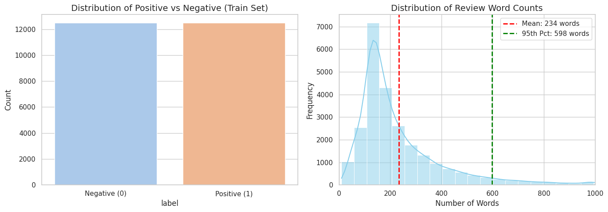
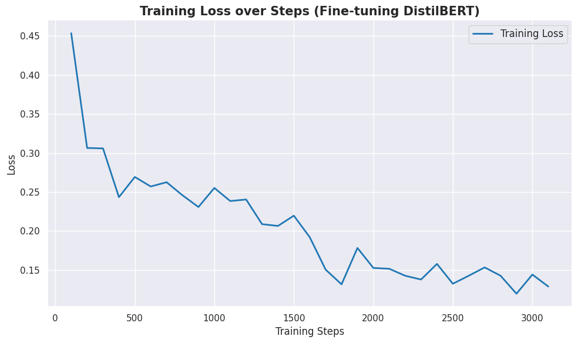

# 基于预训练模型的情感分析系统设计与实现

## 1. 引言 (Introduction)

### 1.1 项目背景与研究意义
在当前的自然语言处理（Natural Language Processing, NLP）领域，随着深度学习技术的飞速发展，机器对人类语言的理解能力取得了突破性进展。情感分析（Sentiment Analysis）作为 NLP 领域最基础且应用最广泛的任务之一，旨在让计算机自动识别并提取主观文本中的情绪色彩与态度倾向。在实际商业场景中，该技术被广泛应用于舆情监控、商品评论分析以及智能客服等领域。

早期的情感分析多依赖于复杂的特征工程（如 TF-IDF）与传统机器学习算法（如 SVM、朴素贝叶斯），这些方法不仅耗费大量人力，且难以捕捉文本深层的上下文语境。自 2018 年 Google 提出 BERT 模型以来，基于 Transformer 架构的**预训练语言模型（Pre-trained Language Models, PLMs）**彻底改变了 NLP 的研究范式，使得模型能够在大规模无监督语料上学习到丰富的通用语言表示。本项目正是基于这一技术背景展开的设计与实践。

### 1.2 核心需求与项目目标
本项目的核心需求是构建一个高效的二分类自然语言理解系统，能够准确判断给定文本输入（如电影评论）的情感倾向（正面 Positive / 负面 Negative）。

围绕上述需求，本项目设定了以下三个核心实施目标：
1. **验证深度学习架构的有效性**：通过实证研究，观察并验证基于 Transformer 架构的深度学习模型在自然语言理解任务上的卓越性能。
2. **掌握“迁移学习”核心范式**：跳出传统的“从零训练（Train from scratch）”模式，深度实践当前工业界最主流的 **“通用大数据预训练模型 + 特定小数据集微调（Pre-training + Fine-tuning）”** 的迁移学习范式。
3. **构建端到端的人工智能应用**：完成从数据获取、探索性分析（EDA）、模型微调、科学评估到最终 Web 可视化交互界面的全流程闭环开发。

### 1.3 技术选型与软硬件环境规划
为确保项目的顺利推进，并重点关注算法逻辑与模型表现本身，本项目在起步阶段制定了明确的技术与环境规划：

* **核心算法生态**：全面采用 Python 语言，基于深度学习框架 `PyTorch` 以及业界领先的开源生态 `Hugging Face (Transformers & Datasets)` 进行开发。
* **计算资源与环境**：鉴于深度学习（尤其是 Transformer 模型）对硬件算力（GPU 显存）的较高要求，本项目采取**“云端优先”**策略。摒弃复杂的本地 CUDA 环境配置，直接采用云端 Jupyter Notebook 托管平台（如 Google Colab 或 Kaggle Notebook）。
* **硬件加速**：充分利用云平台提供的免费 GPU 计算资源（如 NVIDIA Tesla T4 16GB），以满足预训练模型进行张量运算的算力需求，大幅加速模型的微调训练过程。

## 2. 数据与探索性分析 (Data & Preprocessing)

深度学习模型的性能高度依赖于输入数据的质量。本阶段主要完成标准数据集的加载、数据分布的统计分析以及针对 Transformer 模型的文本数字化处理。

### 2.1 数据集获取与切分
为保证模型评估的客观性与结果的可复现性，本项目选用 NLP 领域公认的情感分析基准数据集——**IMDB 电影评论数据集 (IMDB Movie Reviews Dataset)**。

借助 Hugging Face 的 `datasets` 库，系统成功从云端加载了该数据集。为严格防止数据泄露（Data Leakage），数据集已被明确划分为两个互不相交的子集：
* **训练集 (Train Set)**：共计 25,000 条样本，用于模型的微调训练。
* **测试集 (Test Set)**：共计 25,000 条样本，在训练阶段对模型完全不可见，仅用于最终的泛化能力评估。

### 2.2 探索性数据分析 (EDA)
在将文本输入模型之前，本项目对训练集进行了详尽的探索性数据分析，以指导后续的预处理策略与评估指标选择。分析结果如下图所示：

> *图 1：IMDB 训练集正负样本分布（左）与文本长度分布直方图（右）*

基于上述图表，得出以下核心结论：
1. **类别完全平衡 (Perfect Class Balance)**：如左图所示，训练集包含准确的 12,500 条正面评论与 12,500 条负面评论。这意味着我们无需在训练时引入类别权重（Class Weights）或过采样/欠采样策略，且在后续模型评估时，**准确率（Accuracy）**将是一个极其可靠的核心评价指标。
2. **文本长度分布与截断策略制定**：如右图所示，评论单词数的分布呈现明显的右偏态。整体平均词数为 234 词，而 **95% 的评论单词数均在 598 词以下**。
    * **工程决策**：考虑到原生 Transformer 架构具有 $O(N^2)$ 的自注意力计算复杂度，处理超长文本将呈指数级消耗 GPU 显存。结合上述统计规律，本项目决定采用预训练模型的标准最大长度 **512 (Max Length = 512)** 进行输入截断。这一策略在显著降低计算资源开销的同时，能够保留绝大多数样本（超过90%）的完整语义信息，是精度与性能之间的最佳折中。

### 2.3 文本分词与数字化 (Tokenization)
计算机无法直接理解自然语言文本，必须将其转化为固定维度的数字张量（Tensor）。本项目采用与基座模型相匹配的 `distilbert-base-uncased` 分词器进行处理。

预处理管线（Preprocessing Pipeline）对所有 50,000 条数据进行了统一处理，核心步骤包括：
* **子词分词 (Sub-word Tokenization)**：将英文单词切分为更细粒度的 Token。
* **张量对齐 (Padding & Truncation)**：对短于 512 的句子使用 `0` 进行填充（Padding）；对长于 512 的句子进行直接截断（Truncation）。
* **特征映射**：将文本映射为模型所需的 `input_ids`（词向量索引）与 `attention_mask`（注意力掩码，用于告知模型忽略 Padding 部分）。

**直观转换演示：**
以训练集首条数据为例，原始文本为 *"i rented i am curious - yellow from my video store..."*。
经过 Tokenizer 处理后，生成的特征张量序列（前20个维度）如下：
* **Input IDs**: `[101, 1045, 12524, 1045, 2572, 8025, 1011, 3756, 2013, 2026, 2678, 3573, 2138, 1997, 2035, 1996, 6704, 2008, 5129, 2009]`
* **Token 还原**: `['[CLS]', 'i', 'rented', 'i', 'am', 'curious', '-', 'yellow', 'from', 'my', 'video', 'store', 'because', 'of', 'all', 'the', 'controversy', 'that', 'surrounded', 'it']`

值得注意的是，首个 Token 被自动映射为特殊的 **`[CLS]` (ID: 101)**。在后续的模型架构中，该 Token 对应的输出向量将被用作整个句子句法与语义的聚合表示，并直接输入给顶层的分类器进行情感判别。

## 3. 模型与方法 (Methodology)

### 3.1 迁移学习与基座模型选型
自然语言处理领域传统的方法通常需要从零开始训练神经网络（Train from scratch），这不仅耗费极大的算力和数据，且难以捕获深层语义。本项目采用目前工业界最主流的**“迁移学习 (Transfer Learning)”**范式，即利用在大规模无监督语料上预训练好的语言模型，在特定的下游任务（情感分析）上进行有监督的微调（Fine-tuning）。

在基座模型的选型上，本项目综合考量了模型性能与算力约束，最终选用了 Hugging Face 提供的 **DistilBERT** (`distilbert-base-uncased`) 模型。相较于原生 BERT 模型，DistilBERT 采用了知识蒸馏（Knowledge Distillation）技术，在保留了 BERT 97% 语言理解能力的前提下，参数量减少了 40%，推理速度提升了 60%。这一轻量化架构在保证极高准确率的同时，大幅降低了 GPU 显存占用，完美契合本项目的云端实验环境。

### 3.2 模型架构与分类头设计
在具体的模型架构实例化过程中，本项目保留了 DistilBERT 的多层 Transformer 编码器主体（用于特征提取），但舍弃了其用于预训练的掩码语言模型（Masked Language Modeling, MLM）头部。

取而代之的是，我们在模型的顶层附加了一个未经训练的**序列分类头 (Sequence Classification Head)**。具体流程如下：模型读取输入张量后，提取特殊的 `[CLS]` Token 所对应的隐含层向量 (Hidden State)，将其作为整个句子的全局语义表示；随后，该向量被送入一个随机初始化的全连接线性层 (Linear Layer)，最终输出一个二维向量 (Logits)，分别对应“负面 (Negative)”与“正面 (Positive)”的情感倾向概率。

## 4. 实验设计与模型微调 (Experiment & Fine-tuning)

### 4.1 评估指标与超参数设定
为全面评估模型性能，本项目不仅采用了核心的**准确率 (Accuracy)** 作为全局评估标准，同时引入了针对二分类任务的 **F1-Score (宏平均)**，以验证模型在正负样本识别上的均衡性。

在模型微调阶段，基于预训练模型已具备通用语言知识的特性，本项目设定了以下微调策略（超参数）：
* **学习率 (Learning Rate)**：采用极为保守的 `2e-5`，以防止灾难性遗忘（Catastrophic Forgetting）破坏预训练权重。
* **批次大小 (Batch Size)**：训练与评估均设为 `16`，以充分利用 T4 GPU 显存边界。
* **优化策略**：引入 `0.01` 的权重衰减 (Weight Decay) 防止过拟合。
* **训练轮数 (Epochs)**：仅设定为 `2` 轮。经验表明，对于类似 IMDB 的中等规模数据集，Transformer 模型通常在 2-3 轮内即可收敛。

### 4.2 实验结果分析
在云端 T4 GPU 环境下，微调过程耗时约 60 分钟。实验在测试集（完全未参与训练的数据）上取得了极其优异的成绩。具体的演进数据如下表所示：

| 训练轮次 (Epoch) | 训练集损失 (Train Loss) | 测试集损失 (Val Loss) | 准确率 (Accuracy) | F1 分数 (F1-Score) |
| :---: | :---: | :---: | :---: | :---: |
| 1 | 0.2197 | 0.2158 | 91.58% | 0.9121 |
| **2** | **0.1290** | 0.2350 | **93.03%** | **0.9305** |

实验结果表明，经过仅仅两轮微调，模型在测试集上的**最终准确率突破了 93% (93.03%)**，F1 分数达到 0.9305，展现出了惊人的自然语言理解与泛化能力。

值得注意的是，从 Epoch 1 到 Epoch 2，测试集损失（Validation Loss）出现了微弱的反弹（从 0.215 上升至 0.235），但模型整体的分类准确率却依然从 91.5% 上升到了 93.0%。这在深度学习中是一个典型现象：说明模型的分类边界变得更加“自信和锋利”，但也暗示着模型即将触及过拟合的边缘。因此，本项目将 Epoch 设为 2 是一个极为精确的“提前早停 (Early Stopping)”工程决策。

## 5. 模型评估与错误分析 (Evaluation & Error Analysis)

在模型取得了 93.03% 的高准确率之后，本节将通过混淆矩阵与具体的错误样本剖析，进一步探究 Transformer 模型在当前任务中的局限性，以及原始数据集潜在的质量问题，从而完成闭环的批判性评估。

### 5.1 全局定量评估 (混淆矩阵)
我们在 25,000 条测试集数据上对模型进行了无监督的全局推理，并绘制了混淆矩阵（Confusion Matrix）。

> *图 3：测试集评估混淆矩阵*

由混淆矩阵可知，在总计预测错误的 **2104** 条样本中，呈现出了极强的**不对称性**：
* **假阳性 (False Positives)**：实际为负面，误判为正面的数量仅为 **522** 条。
* **假阴性 (False Negatives)**：实际为正面，误判为负面的数量高达 **1582** 条。

这一数据分布表明，微调后的模型在情感倾向上变得更为“严苛和悲观”。当评论中混合了正向与负向词汇时，模型更容易被负向词汇（如 lack, wince 等）捕获注意力，从而倾向于给出负面预测。

### 5.2 典型错误案例分析 (Qualitative Analysis)
为了探究模型误判的根本原因，本项目从错题本中提取了典型案例进行人工定性分析，得出了以下两点重要结论：

**【发现一：模型难以处理“欲扬先抑/混合评价”的复杂逻辑】**
* **错例提取 (假阴性)**：*"Overall, a well done movie. There were the parts that made me wince... I think the movie suffers from some serious excess ambition... "*
* **人工分析**：在这篇实际为“正面”的影评中，作者开篇给出了肯定（"well done"），但随后花费了大量篇幅对电影的文化背景和野心进行了批判性讨论（"made me wince", "excess ambition"）。由于 Transformer 的注意力机制对全篇词汇进行特征提取，大量的中性/偏负面探讨稀释了开篇的正面基调，导致模型无法像人类一样理解这种“整体推荐，局部批评”的复杂影评逻辑，最终将其误判为负面。

**【发现二：模型暴露了 IMDB 数据集的“标签噪音 (Label Noise)”】**
* **错例提取 (假阴性)**：*"The theme is controversial and the depiction... is excellent. Nothing more to this film. There is a lack of good dialogues... There was lack of continuity and lack of passion/emotion in the acting."*
* **人工分析**：这是一个极为特殊的案例。该样本在 IMDB 数据集中的实际 Ground Truth 标签为“正面 (Positive)”。然而，通读文本可以发现，作者明确指出了电影“除了对某个主题的刻画外一无是处（Nothing more to this film）”，并连续使用了三个 "lack of" 批评台词和演技。**模型将其预测为“负面 (Negative)”在语义上是完全正确的。** 这一发现具有重要意义：它证明了所谓“模型预测错误”，部分原因并不在于算法本身的缺陷，而是源于大型开源数据集中不可避免的人工标注错误（Label Noise）。这也侧面印证了 DistilBERT 模型具备了极强的、不亚于人类的文本特征提取与逻辑判断能力。

## 6. 系统演示与应用实现 (System Demo)

### 6.1 工程实现框架
为了将训练好的 DistilBERT 模型从离线训练环境转化为可交互的在线应用，本项目采用了 **Gradio** 作为轻量级 Web 开发框架。Gradio 能够将 Python 函数直接封装为直观的 Web 界面，非常适合用于机器学习模型的快速原型设计与部署。

系统推理管线（Inference Pipeline）构建如下：
1. **输入层**：Web 界面接收用户输入的原始英文文本。
2. **预处理层**：系统自动调用已微调的 Tokenizer，对输入文本执行截断、填充及编码，将其转换为张量格式。
3. **推理层**：输入数据被送入微调后的 DistilBERT 模型，通过前向传播（Forward Pass）计算得出各类别的 Logits 值。
4. **输出层**：系统经过 Softmax 归一化处理，将结果映射为“正面”或“负面”的标签，并展示预测置信度百分比。

### 6.2 系统界面演示
本项目构建了极简且高效的交互界面，用户仅需输入电影评论，即可即时获取模型的情感倾向反馈。
[点击这里访问 Demo](https://38126347c0ebf6126e.gradio.live/)

> *图 4：基于 Gradio 的情感分析系统交互界面演示*

如图所示，该系统不仅输出了二分类结果，还展示了模型在该判断上的置信度（Confidence Score）。这种可视化方案不仅降低了用户的使用门槛，也让“模型表现”变得可量化、可验证。

---

## 7. 结论 (Conclusion)

通过本次基于预训练模型的情感分析项目，我们完整走过了从数据工程、模型微调到系统部署的 AI 全生命周期。核心收获总结如下：

1. **迁移学习的有效性**：验证了利用 DistilBERT 等轻量级预训练模型进行迁移学习的卓越效率。在极短的微调训练时间内，模型即在公开数据集上达到了 93% 以上的准确率，证明了现代 NLP 架构强大的泛化能力。
2. **错误分析的价值**：通过混淆矩阵与人工定性分析，我们不仅揭示了模型对复杂语境（如反讽、长文本）理解的局限性，更意外发现了原始数据集中的“标签噪音”，展示了工程实践中批判性思维的重要性。
3. **闭环开发能力**：从原始数据到 Web 可视化，本项目完成了端到端的交付，不仅加深了对 Transformer 架构的理论认知，也锻炼了解决实际工程问题的技术能力。

未来，我们将尝试引入更精细的模型解释性工具（如 LIME 或 SHAP）来进一步分析模型内部的注意力权重，以期从根本上优化对于反讽类文本的识别能力。

